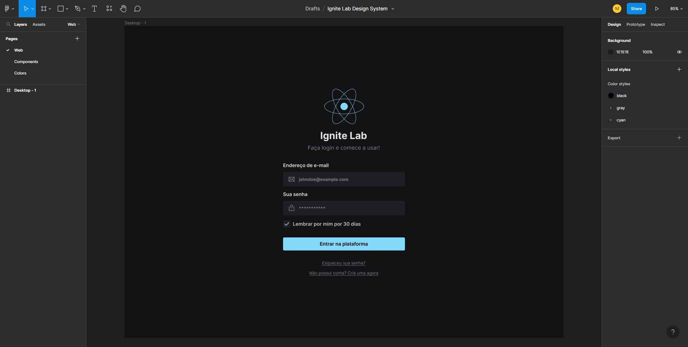
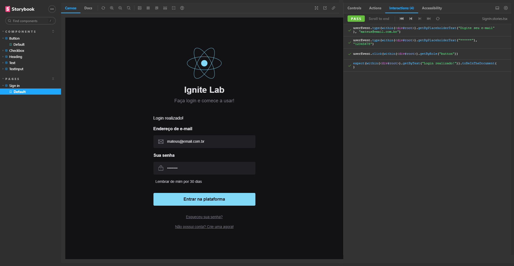
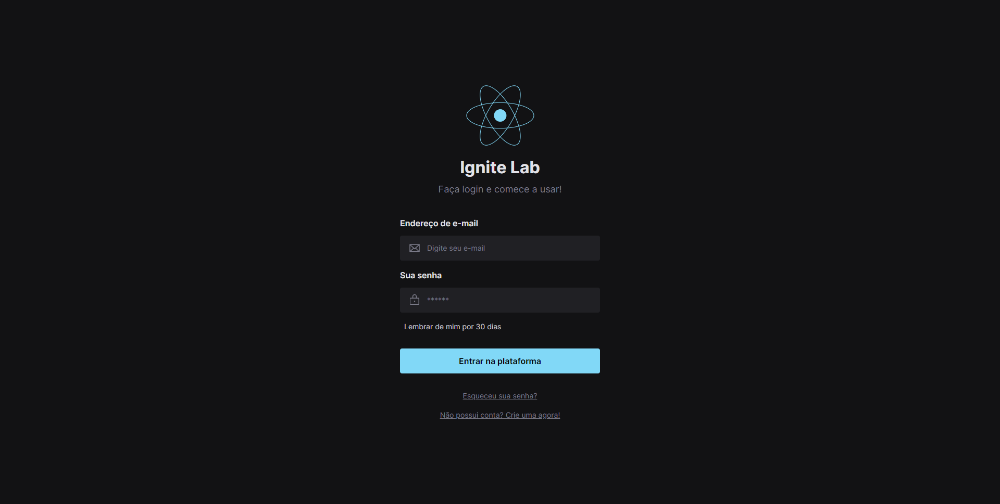

# Ignite Lab Design System

Application made during RocketSeat's Ignite Lab Design System edition event (https://www.rocketseat.com.br/)

## The Project

The project consists of a complete design system, from prototyping in figma, documentation of components with storybook, development of the interface with React, testing and finally automated deployment with GitHub Actions and GitHub Pages.
Thus achieving the learning of a complete development of a modern front-end web application.

## Technologies

The following technologies were used in the development of the project:

<ul>
    <li>
        Figma
        <p>
            Tool used to prototype the interface, creating color palettes and components.
        </p>
    </li>
    <li>
        Vite
        <p>
            Used for project creation, a much faster option than create-react-app, supports typescript (used in the project) and other cutting-edge technologies.
        </p>
    </li>
    <li>
        React
        <p>
            Currently the most popular library for developing front-end web interfaces, evolving with each version and having a huge community supporting it.
        </p>
    </li>
    <li>
        TypeScript
        <p>
            Adding typing to javascript, making it easier to catch errors during development, and including the IDE's IntelliSense, making development easier.
        </p>
    </li>
    <li>
        Storybook
        <p>
            Solution to document the front-end, creating the components, their attributes, properties and even the application pages, helping to maintain a design system. It has full integration with react and testing.
        </p>
    </li>
    <li>
        Tailwind CSS
        <p>
            Library that brings CSS classes and other elements ready to use in development, thus accelerating the creation of interfaces. But it is also possible to change the color palettes and other classes in an easy way and without having to directly change the CSS code.
        </P>
    </li>
    <li>
        Radix-ui
        <p>
            Tool that brings reusable components, without styling ready to be used in the creation of the interface.
        </p>
    </li>
    <li>
        Jest
        <p>
            JS framework to carry out automated and simple tests, it has integration with React and storybook, thus being able to test each interaction in the documentation itself.
        </p>
    </li>
    <li>
        Mock Service Worker: MSW
        <p>
            Used to intercept external requests and simulate responses from a given API.
        </p>
    </li>
    <li>
        GitHub Actions
        <p>
            Used to automate the workflow, performing the continuous deployment of the design system with each commit made in the remote repository.
        </p>
    </li>
    <li>
        GitHub Pages
        <p>
            Free solution to host static files, used for system design.
        </p>
    </li>
</ul>

## Interface Prototype

During the classes, the interface prototype was developed in Figma, which can be seen [here](https://www.figma.com/file/deUKSSFh08h5fqtXUX7dKF/Ignite-Lab-Design-System?node-id=5%3A58&t=RcYClD8T6i8OyODS-1).



## Design System Documentation

Design System documentation can be accessed [here](https://mateusgiroletti.github.io/ignite-lab-design-system/).


## Test the project yourself

To run the project locally just clone the repository and run the following commands.

Clone on your machine:

```console
git clone https://github.com/mateusgiroletti/ignite-lab-design-system.git
```

Change to project directory and install dependencies via npm:

```console
cd ignite-lab-design-system && npm ci --legacy-peer-deps
```

Start running the storybook run:

```console
npm run storybook
```

Accessing the link provided in the console output, the expected result is this:



And to run the developed interface:

```console
npm run dev
```

Accessing the link provided in the console output, the expected result is this:


